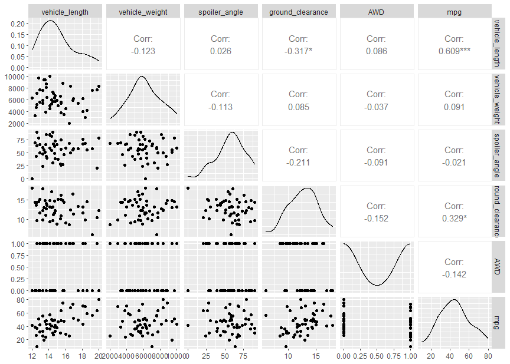

# MechaCar-Statistical-Analysis
## Linear Regression to Predict MPG
### Which variables/coefficients provided a non-random amount of variance to the mpg values in the dataset?
The coefficients with extremely low p-values and have a statistically significant relationship with the response variable in this model are ground clearance and vehicle length which intuitively makes sense as these two variables contribute the most to the aerodynamics of the vehicle. Vehicle weight has a p-value of 0.0776 which is slightly over the 0.05 significance threshold which doesn't necessarily rule out any correlation to mpg but is clearly not a major factor within this data set. Then there is AWD and spoiler angle which have almost no effect on mpg. 
### 
### Is the slope of the linear model considered to be zero? Why or why not?
The slope of this model is not considered to be zero due to the positive correlation between mpg and the contributing variables.
### 
### Does this linear model predict mpg of MechaCar prototypes effectively? Why or why not?
With a r sqared value of 0.715 it can be concluded that the predictor variables for mpg can be used to find out the repose variable. However, finding a benchmark within the automotive industry to predict mpg to compare to would allow for further confirmation that the model works.
### 
## Summary Statistics on Suspension Coils
### The design specifications for the MechaCar suspension coils dictate that the variance of the suspension coils must not exceed 100 pounds per square inch. Does the current manufacturing data meet this design specification for all manufacturing lots in total and each lot individually? Why or why not?
The variance of suspension coils for the entire MechaCar manufacturing plant is 62.3 which is under the 100 lbs./in.^2 threshold but is still a significant variance in my mind. Once again, it would be good to compare this variance to industry standard to have a real idea of if this acceptable. 
### 
When the summary statistics are disaggregated by lots, Lot 1 has a very small variance of 0.98, lot 2 is at 7.47 and then lot 3 jumps way over the threshold to 170.3. I believe this is also the primary culprit in why the overall variance of suspension coils for the plant is so high. Clearly lot 3 has some issues manufacturing their suspension coils and should stop production and diagnose the problem before a large-scale recall occurs. 
### 
## T-Tests on Suspension Coils
Using the one-sided t-test to compare all the manufacturing lots to the population mu (mean) of 1500 PSI/in.^2 the is a p-value of 0.06 which is above the significance level of 0.05. Therefore there is not enough evidence to reject the null hypothesis that the two means are statistically different. 
### .PNG)
When comparing the sample population to the subset of manufacturing lot 1 using a t-test, a p-value of 1 is returned meaning the two populations means are the exact same. When comparing to lot2 a p-value of 0.61 is returned verifying again that the two means are are statistically the same. lastly, when comapring the population to the subset of lot 3 the p-value is 0.04 which is below the 0.05 significance level which states that there is a statistical difference between the distribution means of the two samples. This confirms the analysis performed in part 2 where lot 3 had a significantly higher variance in PSI for the suspension coils. 
### .PNG)
### .PNG)
### .PNG)
## Study Design: MechaCar vs Competition
### Write a short description of a statistical study that can quantify how the MechaCar performs against the competition. In your study design, think critically about what metrics would be of interest to a consumer: for a few examples, cost, city or highway fuel efficiency, horse power, maintenance cost, or safety rating.
What metric or metrics are you going to test?
The main two metrics that are important to me when evaluating a vehicle for my family are safety rating and cargo capacity. The study would be to find if there is a correlation between cargo capacity and safety rating due to the intuitive component that the larger the vehicle the safer it is against other vehicles and that it would have a larger cargo capacity at the same time due to being larger itself. 
What is the null hypothesis or alternative hypothesis?
The null hypothesis for this study is that the higher the vehicle safety rating the larger the cargo capacity is, compared to other vehicles in its class. 
The alternative hypothesis is that the higher the safety rating the lower the amount of cargo capacity. 
What statistical test would you use to test the hypothesis? And why?
According to this flowchart I found on [scribbr.com](https://www.scribbr.com/statistics/statistical-tests/) performing a multiple regression analysis would be the best method to determine the safest vehicle with the best cargo capacity per vehicle class. 
What data is needed to run the statistical test?
Vehicles broken down by class such as, SUV, truck, compact, etc.., safety ratings, cargo capacity in volume and weight and cost would be a good metric to evaluate during this study as well. 

